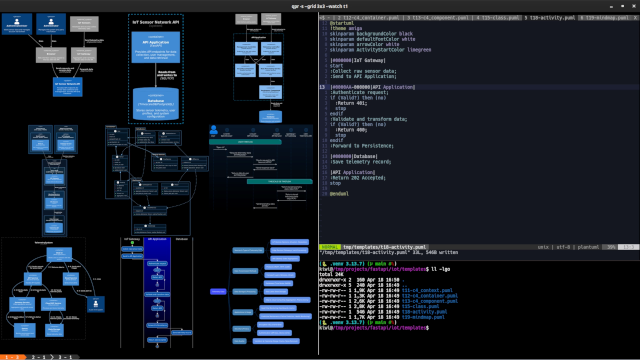

# qpr - Quick PlantUML Renderer

`qpr` is a minimal Bash/Dash/Zsh wrapper for rendering [PlantUML diagrams](https://plantuml.com/) via the official [Docker image](https://hub.docker.com/r/plantuml/plantuml), with optional image output in the [Kitty terminal](https://sw.kovidgoyal.net/kitty/). It provides a simple interface for generating PNG and SVG output and fits naturally into integrated, terminal-centric development workflows.

<p align="center">
  <a href="https://res.cloudinary.com/du23meydk/video/upload/v1776546530/qpr_demo_v3_tcfaoy.mp4">
    
  </a>
  <br/>
  <em>(Demo video)</em>
</p>

## Features

- **POSIX Compliant**: Compatible with `bash`, `dash`, and `zsh`.
- **Docker-powered**: Requires no local dependencies other than Docker. The script will prompt you to pull the [plantuml/plantuml:latest](https://hub.docker.com/r/plantuml/plantuml-server) image if it's not available locally.
- **Server Support** (`--server`, localhost:8080): Can pull the [plantuml/plantuml-server:jetty](https://hub.docker.com/r/plantuml/plantuml-server) image for significantly faster rendering.
- **Batch Rendering**: Supports multiple files or filename prefixes.
- **Live Reload**: Automatically re-renders files when changes are detected using `--watch`.
- **Terminal Preview**: Integration with Kitty terminal (`kitten icat`) to display diagrams directly in the terminal.
- **Advanced Layouts**: Supports paged output, overlays, and image grids.

## Prerequisites

- [Docker](https://www.docker.com/)
- (Optional) [Kitty Terminal](https://sw.kovidgoyal.net/kitty/) for the `--print` feature.

## Installation

1. Download the `qpr` script.
2. Make it executable:
   ```bash
   chmod +x qpr
   ```
3. Move it to a directory in your `PATH` (e.g., `~/.local/bin` or `/usr/local/bin`).

## Usage

`qpr` accepts both full filenames and filename prefixes. If a prefix is provided, it will render all matching `.puml` files.

```bash
qpr [options] <prefix-or-filename>...
```

### Options

- `--png`             Output PNG images (default)
- `--svg`             Output SVG images
- `--txt`             Output ASCII art diagrams
- `--print`           Display PNG/TXT in terminal (ignored for SVG)
- `--page`            Display paged PNG image (implies `--print`, `--quiet`)
- `--overlay`         Display PNG image overlay (implies `--print`, `--quiet`)
- `--grid=ColsxRows`  Display PNG image grid, e.g 4x3 (implies `--print`, `--quiet`)
- `-s`, `--server`    Use a PlantUML server (localhost:8080)
- `-w`, `--watch`     Watch for file changes and re-render
- `-q`, `--quiet`     Suppress output messages
- `-h`, `--help`      Show help message.

### Examples

Render a specific `.puml` file to PNG:
```bash
qpr diagram.puml
```

Render all `.puml` files starting with the prefix "c4" to PNG and preview them in the terminal:
```bash
qpr --print c4
```
### Templates

The repository includes a `templates/` directory with starter files that you can copy and modify for testing the `qpr` workflow: [Activity Diagram](https://plantuml.com/activity-diagram-beta), [C4 Model](https://c4model.com) (Context, Container and Component diagrams using the [C4-PlantUML](https://github.com/plantuml-stdlib/C4-PlantUML) library) and [Class Diagram](https://plantuml.com/class-diagram) and .
## Integration

The `qpr` workflow integrates PlantUML into a terminal-based, IDE-like experience suitable for occasional diagramming. More of a concept than a fully-fledged tool, `qpr` may not have reached its limits yet and could be further improved. This section outlines some ideas for future enhancements.


### Basic Concept
A graphics-capable terminal UI divided into three panes: a rendering layer, a code editor, and an AI agent for interactive assistance.

```
  Terminal (graphics-capable)
  +------------------------+------------------------+
  | Renderer (qpr)         | Editor (multi-tab)     |
  |                        |                        |
  |                        |                        |
  |                        |                        |
  |                        |                        |
  |                        |                        |
  |                        |                        |
  |                        |                        |
  |                        +------------------------+
  |                        | AI agent               |
  |                        |                        |
  +------------------------+------------------------+
```


### Potential Improvements
- Terminal
  - Add keyboard shortcuts and commands to improve the IDE-like experience.
- Renderer
  - Keep the PlantUML instance warm to speed up rendering of multiple diagrams.
  - Improve robustness of image output during scrolling.
- Editor
  - Add keyboard shortcuts and plugin support to enhance the IDE-like experience.
- AI Agent
  - Explore LLMs and prompting strategies that perform well in an IDE workflow.

## Acknowledgments

<<<<<<< HEAD
- [PlantUML](https://plantuml.com/) for its powerful diagramming capabilities.
- [Kitty](https://sw.kovidgoyal.net/kitty/) for its excellent graphics protocol.
- [C4](https://c4model.com) for making software architecture easier to visualize and understand.
=======
- **PlantUML** for its powerful diagramming capabilities.
- **Kitty** for its excellent graphics protocol.
- **C4 model** for making software architecture easier to visualize and understand.
>>>>>>> development
