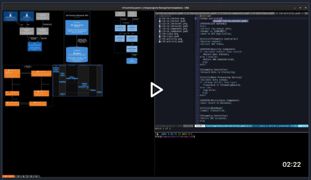

# qpr - Quick PlantUML Renderer

`qpr` is a lightweight Bash, Dash or Zsh script that renders [PlantUML](https://plantuml.com/) diagrams using [Docker](https://www.docker.com/). It simplifies the process of generating SVG or PNG diagrams from the terminal without requiring a local Java or PlantUML installation. Diagrams can also be displayed directly in graphics-capable terminals (currently supporting [Kitty](https://sw.kovidgoyal.net/kitty/)).

<p align="center">
  <a href="https://res.cloudinary.com/du23meydk/video/upload/v1775570388/demo_rlreav.mp4">
    
  </a>
  <br/>
  <em>Demo video</em>
</p>

## Features

- **POSIX Compliant**: Compatible with `bash`, `dash`, and `zsh`.
- **Docker-powered**: No local dependencies other than Docker. The script will prompt to pull the [plantuml/plantuml](https://hub.docker.com/r/plantuml/plantuml) image if it's not found locally.
- **SVG & PNG Support**: Default output is SVG, with an option for PNG.
- **Batch Rendering**: Supports multiple files or filename prefixes.
- **Terminal Preview**: Integration with Kitty terminal (`kitten icat`) to display diagrams directly in your terminal.
- **Smart Path Handling**: Automatically resolves relative paths for Docker volume mounting.

## Templates

The repository includes a `templates/` directory with starter files that you can copy and modify for testing the `qpr` workflow:
- **[C4 Diagrams](https://c4model.com)**: Templates for System Context, Container, Component, and Code diagrams using the [C4-PlantUML](https://github.com/plantuml-stdlib/C4-PlantUML) library.
- **Class Diagrams**
- **Activity Diagrams**

## Prerequisites

- [Docker](https://www.docker.com/)
- (Optional) [Kitty Terminal](https://sw.kovidgoyal.net/kitty/) for the `--print` feature.

## Installation

1. Download the `qpr` script.
2. Make it executable:
   ```bash
   chmod +x qpr
   ```
3. Move it to a directory in your `PATH` (e.g., `~/.local/bin` or `/usr/local/bin`).

## Usage

`qpr` accepts both full filenames and filename prefixes. If a prefix is provided, it will render all matching `.puml` files.

```bash
qpr [options] <prefix-or-filename>...
```

### Options

- `--png`          Output PNG instead of the default SVG.
- `--print`        Display the resulting PNG in the terminal (requires Kitty terminal). Implies the `--png` flag.
- `-q, --quiet`    Suppress status messages.
- `-h, --help`     Show help message.

### Examples

Render a specific `.puml` file to SVG:
```bash
qpr diagram.puml
```

Render all `.puml` files starting with the prefix "c4" to PNG and preview them in the terminal:
```bash
qpr --print c4
```

